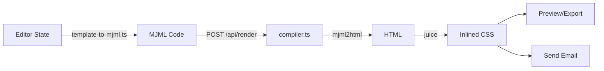

# 📧 Email Designer

<div align="center">


**Build beautiful, responsive email templates with drag-and-drop or code**

[](https://emaildesigner.elsaltoweb.es/)
[](https://github.com/AndrewUru/email-designer)

</div>

---

## ✨ Features

<table>
<tr>
<td width="50%">

### 🎨 No-Code Editor

- Intuitive drag-and-drop interface
- Visual block reordering
- Real-time properties panel
- Perfect for designers & marketers

</td>
<td width="50%">

### 💻 Pro Code Mode

- Direct MJML editing
- Live preview updates
- Full control for developers
- Export production-ready HTML

</td>
</tr>
</table>

### 🚀 Core Capabilities

- **Production-Ready Export** — MJML → HTML with inlined CSS for maximum compatibility
- **Auto-Save** — Never lose your work with automatic localStorage persistence
- **Gmail Integration** — One-click copy and compose
- **Live Testing** — Send real test emails via Resend API
- **Responsive Design** — Mobile-optimized emails out of the box

---

## 🧩 Available Blocks

| Block            | Description                              |
| ---------------- | ---------------------------------------- |
| 📝 **Text**      | Rich text content with styling options   |
| 🖼️ **Image**     | Responsive images with alt text          |
| 🔘 **Button**    | Call-to-action buttons with custom links |
| ➖ **Divider**   | Visual separators for content sections   |
| 📐 **2 Columns** | Side-by-side content layout              |

---

## 🛠️ Tech Stack

```
Frontend          State & Storage       Email Processing
━━━━━━━━━━━━━━━━  ━━━━━━━━━━━━━━━━━━━  ━━━━━━━━━━━━━━━━━━
Next.js 14        Zustand               MJML
TypeScript        localStorage          Juice (CSS inlining)
Tailwind CSS v4                         Resend (API)
dnd-kit
Monaco Editor
```

---

## 🚀 Quick Start

```bash
# 1. Clone the repository
git clone https://github.com/AndrewUru/email-designer.git
cd email-designer

# 2. Install dependencies
npm install

# 3. Set up environment variables
cp .env.example .env.local
# Add your RESEND_API_KEY

# 4. Run the development server
npm run dev

# 5. Open in your browser
open http://localhost:3000
```

---

## ⚙️ Environment Variables

Create a `.env.local` file:

```env
RESEND_API_KEY=re_xxxxx                      # Required for test emails
EMAIL_FROM="onboarding@resend.dev"           # Default sender
EMAIL_REPLY_TO="your-email@domain.com"       # Optional reply-to
```

> **Note:** If `EMAIL_FROM` is not set, defaults to `onboarding@resend.dev`

---

## 📁 Project Structure

```
email-designer/
├── app/
│   ├── api/
│   │   ├── render/route.ts          # MJML → HTML API endpoint
│   │   └── send-test/route.ts       # Test email sending
│   ├── code/page.tsx                # Pro code editor view
│   └── page.tsx                     # No-code drag & drop view
│
├── components/editor/
│   ├── no-code-editor.tsx           # Main no-code interface
│   ├── code-editor-view.tsx         # MJML editor component
│   ├── block-palette.tsx            # Draggable block library
│   ├── canvas-panel.tsx             # Email canvas
│   ├── sortable-canvas-item.tsx     # Individual block wrapper
│   ├── block-properties-panel.tsx   # Properties editor
│   ├── email-preview.tsx            # Live preview iframe
│   └── export-actions.tsx           # Export & send actions
│
├── lib/email/
│   ├── types.ts                     # TypeScript definitions
│   ├── blocks.ts                    # Block factories
│   ├── template-to-mjml.ts          # JSON → MJML converter
│   ├── compiler.ts                  # MJML → HTML + inline CSS
│   └── validation.ts                # Input validation
│
└── store/
    └── email-store.ts               # Global state management
```

---

## 🔄 How It Works



1. **State Management** — Zustand store holds the template
2. **MJML Generation** — Template converts to MJML syntax
3. **Compilation** — Server-side MJML → HTML transformation
4. **CSS Inlining** — Juice library inlines styles for email clients
5. **Output** — Preview, export, or send via Resend

---

## 📧 Gmail Integration

### Open in Gmail

1. Click "Open in Gmail" in toolbar
2. HTML automatically copies to clipboard
3. Gmail compose window opens
4. **Note:** Paste manually (Gmail doesn't render HTML in URL params)

### Send Test Email

1. Click "Send Test" in toolbar
2. Enter recipient and subject
3. Sends real HTML email via Resend
4. ✅ Renders perfectly in Gmail

---

## 🎨 Adding a Custom Block

<details>
<summary>Click to expand step-by-step guide</summary>

### 1. Define the type (`lib/email/types.ts`)

```typescript
export type BlockType = "text" | "image" | "button" | "divider" | "columns2" | "YOUR_BLOCK";

export interface YourBlock {
  id: string;
  type: "YOUR_BLOCK";
  // ... your properties
}

export type EmailBlock = TextBlock | ImageBlock | /* ... */ | YourBlock;
```

### 2. Add factory (`lib/email/blocks.ts`)

```typescript
export function createYourBlock(): YourBlock {
  return {
    id: generateId(),
    type: "YOUR_BLOCK",
    // ... defaults
  };
}
```

### 3. Render to MJML (`lib/email/template-to-mjml.ts`)

```typescript
function blockToMjml(block: EmailBlock): string {
  switch (block.type) {
    // ... existing cases
    case "YOUR_BLOCK":
      return `<mj-YOUR_BLOCK>${block.content}</mj-YOUR_BLOCK>`;
  }
}
```

### 4. Add to palette (`components/editor/block-palette.tsx`)

```typescript
<button onClick={() => addBlock(createYourBlock())}>
  Your Block
</button>
```

### 5. Properties panel (`components/editor/block-properties-panel.tsx`)

```typescript
{selectedBlock.type === "YOUR_BLOCK" && (
  <div>
    {/* Your form fields */}
  </div>
)}
```

</details>

---

## 📜 Available Scripts

| Command             | Description              |
| ------------------- | ------------------------ |
| `npm run dev`       | Start development server |
| `npm run build`     | Build for production     |
| `npm run start`     | Run production build     |
| `npm run lint`      | Run ESLint               |
| `npm run typecheck` | Check TypeScript types   |

---

## 🗺️ Roadmap

- [ ] 📤 Image upload with cloud storage (Vercel Blob/S3/R2)
- [ ] 🧩 More blocks (header, footer, cards, spacers, N-columns)
- [ ] ⏮️ Undo/redo functionality
- [ ] 🎨 Template gallery with presets
- [ ] 🔗 Shareable links with cloud persistence
- [ ] 🌐 Multi-language support
- [ ] 📊 Email analytics integration

---

## 🤝 Contributing

Contributions are welcome! Here's how you can help:

1. 🍴 Fork the repository
2. 🌿 Create a feature branch (`git checkout -b feature/amazing-feature`)
3. 💾 Commit your changes (`git commit -m 'Add amazing feature'`)
4. 📤 Push to the branch (`git push origin feature/amazing-feature`)
5. 🔀 Open a Pull Request

Please follow the [Adding a Custom Block](#-adding-a-custom-block) guide when contributing new blocks.

---

## 📄 License

This project is open source and available under the [MIT License](LICENSE).

---

<div align="center">

**Built with ❤️ using Next.js and MJML**

[Report Bug](https://github.com/AndrewUru/email-designer/issues) · [Request Feature](https://github.com/AndrewUru/email-designer/issues)

</div>
